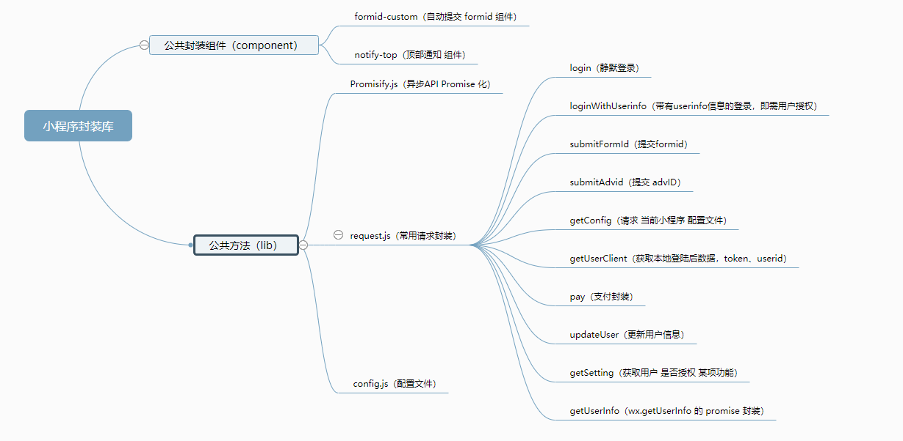

### 置顶：
1. 新建项目公共文件（如request.js formid-custom组件 等）均从这里拷贝
2. 有好的封装实现 写好代码 和 使用说明 提交 pull request，或讨论后直接 push
3. 本项目可以在开发者工具中直接运行，试用Demo

### 小程序 git库 目录结构（**强制**）
    app-XXX-frontend (git 库名称)
        ╎
        ├──── XXX (小程序项目目录，防止微信开发者工具将无用文件打包)
        ╎      ╎
        ╎      ├── lib (原 request.js 或 datasource.js 所在目录，统一命名为 lib)
        ╎      ╎    ╎
        ╎      ╎    └── config.js (将原 request.js 或 datasource.js 中的 config 对象抽离出来，格式在下方)
        ╎      ╎
        ╎      └── project.config.json (小程序自带文件)
        ╎
        └──── 同级目录放一些非项目里的必须文件，如文档，提醒等

`config.js` 格式
```js
const config = {
  appid: 'wxf1v3c2x1vr1f3121',
  host: 'https://game1.zmwxxcx.com',
  commonHost: 'https://common.zmwxxcx.com'
  // 其它内容
}

module.exports = {
  config: config
}
```

### 引入 jump 页面

1. 在 `app.js` 中作如下修改

    ```js
    onShow: function (options) {
      if (options && options.scene == 1038) {
        wx.redirectTo({
          url: '/pages/index/index'
        })
      }
    },
    ```
    
2. 引入 `Page` 目录下的 `jump` 文件夹，并在 `app.json` 中配置 `jump` 页面

# 本项目 目录结构

    .
    ├── component (公共封装组件)
    ╎      ╎ 
    ╎      ├── formid-custom (formid 组件)
    ╎      ╎
    ╎      └── notify-top (顶部通知 组件)
    ╎
    └──  lib (公共方法)
          ╎
          ├── config.js (配置文件)
          ╎
          ├── request.js (常用请求封装)
          ╎
          └── Promisify.js (将异步API Promise 化)


# 脑图



# 公共封装组件(`/component`)

1. [formId 封装组件](component/formid-custom/doc.md)

2. [notify-top 组件Demo](component/notify-top/doc.md)

notify-top 样式:


# 公共方法（`/lib`）

## [request.js](lib/request.js) 常用请求封装（引用了 Promisify.js 和 config.js）

### 使用方法：

1. 引入 `/lib` 目录下 `config.js`, `request.js`  与 `Promisify.js` 文件
2. 在项目 `app.js` 中作如下修改

    ```js
    // app.js
    // 1. 引入 request.js
    import req from 'utils/request.js'
    App({
      onLaunch: function () {
        // 2. 加上登录操作
        req.login()
      },
      // 3. 写入全局变量
      req: req
    })
    ```
3. 其它文件中使用如下

    ```js
    // page 下 index.js
    // 1. 获取全局实例
    const app = getApp()
    Page({
      // ...
      onLoad: function () {
        // 2. 调用实例下的封装方法
        app.req.test()
      }
      // ...
    })
    ```

### 内置方法：

1. login ： 登录方法
2. loginWithUserinfo ： 提交 userinfo 参数的 登录方法
3. submitFormId ： 提交 formid 方法
4. submitAdvid ： 提交 advID 方法
5. pay ： 微信支付 方法
6. updateUser ： 更新用户信息 方法
7. getConfig ： 请求 当前小程序 配置文件
8. getUserInfo ： 获取用户 头像 昵称 等信息 方法（wx.getUserInfo 的 promise 封装）
9. getUserClient ： 获取 Token UserID 方法，返回 {Expire: 1, Token: 'gdsfgd', UserID: 1}，当 Token 为 '' 时，表示 Token 不存在或已失效
10. getSetting ： 获取用户 是否授权 某项功能

### 一些约定：

1. 登陆后获取到用户信息 均存储在 `storage` 中： `{'userClient': data}` ,<br>
   `data` 为 `object`： `{Expire: ‘过期时间戳/s’, Token: 'd3s1ad1sa3', UserID: 1}` , <br>
   返回： 该方法返回 登录接口返回的信息 即含有 `Token UserID` 等
2. 业务 API 方法写进 `request.js` 中，按照其中示例吐出 API 数据即可，调用业务方法时需根据 `Promise` 用法必须加上 `catch` ，如下

    ```js
    // page 下 index.js
    const app = getApp()
    Page({
      // ...
      onLoad: function () {
        app.req.test().then(res => {
          // res 处理
        }).catch(err => {
          // err 处理
        })
      }
      // ...
    })
    ```
3. 业务方法需加上 方法注释，格式如下

    ```js
    /**
     * test 方法 -- 首页调用 接口
     * @param {* 参数1解释} param1
     * @param {* 参数2解释} param2
     */
    test: function (param1, param2) {
      // ...
    }
    ```

## [Promisify.js](lib/Promisify.js) 将异步API Promise 化

[Promise 迷你书](http://liubin.org/promises-book/#introduction)

### 优势如下：

```js
// 旧的写法：
function old() {
  wx.login({
    // ...
    success: res => {
      // ...
      wx.request({
        // ...
        success: res => {
          // ...
          wx.otherAPI({
            // ...
            success: res => {
              // ...
              // 回调地狱
            }
          })
        }
      })
    }
  })
}

// 旧的调用：
old({
  data:{}
  success: res => {...}
  fail: errr => {...}
})

// 新的写法：
import {
  loginPromisify,
  requestPromisify
} from 'Promisify.js'

function now() {
  loginPromisify().then(res => {
    // res 处理
    return requestPromisify({
      url: 'url',
      data: {}
    })
  }).then(res => {
    // res 处理
    return res.data
  }).then(otherAPI).catch(err => {console.log(err)})
}

// 新的调用：
now({data:{}}).then(res => {...}).catch(err => {})

// 规范：
// Promise 中 含有异步请求 写法
// 错误示例：
now().then(res => {
  api1().then(res => {
    api2().then(res => {

    })
  })
})
// 正确写法：
now().then(res => {
  return api1()
}).then(res => {
  return api2()
}).then(res => {

})
```

   
# Tips
- 删去小程序中无用文件，目前小程序会将项目中所有文件打包上传
- 需要频繁切换显示隐藏的元素使用 `<view hidden="{{flag ? true : false}}"> Hidden </view>` ，不要使用 `wx:if wx:else` ，后者会导致重绘
- 小程序中的模板语法不支持 `js` 中的原生方法，如 `{{array.indexOf(1) ? 1 : 0}}` 是不能运行的，仅仅支持简单表达式： `{{array[0] === 1 ? 1 : 0}}`
- 小程序中 所有本地图片 均需使用工具压缩，可以用这个： [https://tinypng.com/](https://tinypng.com/)
- [exports vs module.exports](https://blog.tableflip.io/the-difference-between-module-exports-and-exports/)
- [js object](https://www.w3schools.com/js/js_object_prototypes.asp)
- [require vs es6 import](http://researchhubs.com/post/computing/javascript/nodejs-require-vs-es6-import-export.html)
- 请使用ES6中的 `exprot`, `import`替代ES5中的`module.exports` [import](https://developer.mozilla.org/en-US/docs/Web/JavaScript/Reference/Statements/import), [export](https://developer.mozilla.org/en-US/docs/Web/JavaScript/Reference/Statements/export)
- 小程序自定义组件最低版本为1.6.3。适配率为93.65 + 1.68 + 1.76 + 0.37 + 0.04 = 97.50000000000003 [官方数据](https://mp.weixin.qq.com/debug/wxadoc/dev/framework/client-lib.html)
